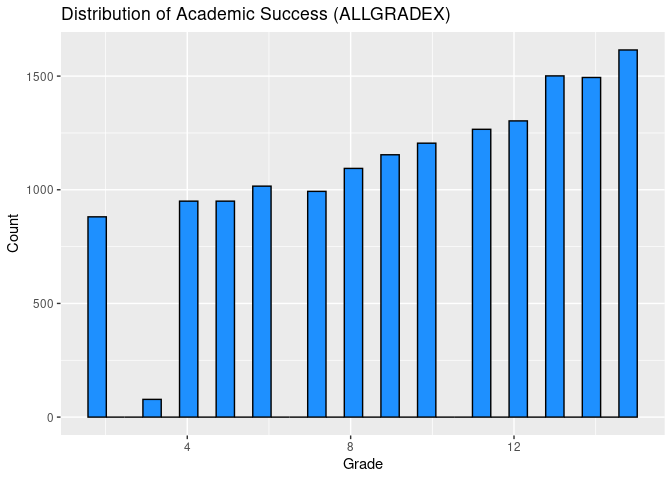

Linear Regression Mini-competition
================

``` r
library("readxl")
```

``` r
library("readxl")

pfi_data <- read_excel("~/STA631/activity08-mini-competition/competition-files/data/pfi-data.xlsx")
```

``` r
print(str(pfi_data))
```

    ## tibble [15,500 × 75] (S3: tbl_df/tbl/data.frame)
    ##  $ BASMID      : num [1:15500] 2.02e+10 2.02e+10 2.02e+10 2.02e+10 2.02e+10 ...
    ##  $ ALLGRADEX   : num [1:15500] 12 4 11 6 9 6 8 5 9 2 ...
    ##  $ EDCPUB      : num [1:15500] 1 1 2 1 1 1 1 1 1 1 ...
    ##  $ SCCHOICE    : num [1:15500] 2 2 2 1 2 1 1 1 1 1 ...
    ##  $ SPUBCHOIX   : num [1:15500] 3 3 2 1 3 2 1 1 1 1 ...
    ##  $ SCONSIDR    : num [1:15500] 2 2 1 1 2 2 2 1 2 2 ...
    ##  $ SCHLHRSWK   : num [1:15500] 4 4 4 4 4 4 4 4 4 4 ...
    ##  $ EINTNET     : num [1:15500] 4 3 3 4 4 4 4 4 4 4 ...
    ##  $ MOSTIMPT    : num [1:15500] -1 -1 2 -1 -1 -1 -1 -1 -1 -1 ...
    ##  $ INTNUM      : num [1:15500] -1 2 2 -1 -1 -1 -1 -1 -1 -1 ...
    ##  $ SEENJOY     : num [1:15500] 2 3 3 1 2 1 1 1 2 2 ...
    ##  $ SEGRADES    : num [1:15500] 1 5 3 1 1 5 1 5 1 5 ...
    ##  $ SEABSNT     : num [1:15500] 1 1 1 1 1 1 1 1 1 2 ...
    ##  $ SEGRADEQ    : num [1:15500] 1 3 4 1 1 1 2 3 1 3 ...
    ##  $ FSSPORTX    : num [1:15500] 2 2 1 1 1 1 2 1 1 1 ...
    ##  $ FSVOL       : num [1:15500] 2 1 1 1 2 2 2 2 1 1 ...
    ##  $ FSMTNG      : num [1:15500] 1 2 1 1 1 1 1 1 1 1 ...
    ##  $ FSPTMTNG    : num [1:15500] 2 2 1 1 2 2 2 2 2 2 ...
    ##  $ FSATCNFN    : num [1:15500] 1 2 1 1 1 1 1 1 1 1 ...
    ##  $ FSFUNDRS    : num [1:15500] 1 2 2 1 1 1 2 1 1 1 ...
    ##  $ FSCOMMTE    : num [1:15500] 2 2 1 1 2 2 2 2 2 2 ...
    ##  $ FSCOUNSLR   : num [1:15500] 2 2 1 1 2 2 2 2 2 2 ...
    ##  $ FSFREQ      : num [1:15500] 2 2 20 3 5 5 3 5 2 4 ...
    ##  $ FSNOTESX    : num [1:15500] 2 1 2 1 1 1 1 1 2 1 ...
    ##  $ FSMEMO      : num [1:15500] 1 1 1 1 1 1 1 1 1 1 ...
    ##  $ FCSCHOOL    : num [1:15500] 2 1 4 1 1 1 1 1 1 1 ...
    ##  $ FCTEACHR    : num [1:15500] 2 2 3 1 1 1 2 1 1 1 ...
    ##  $ FCSTDS      : num [1:15500] 1 1 4 1 1 1 1 1 1 2 ...
    ##  $ FCORDER     : num [1:15500] 2 1 4 1 1 1 1 1 1 2 ...
    ##  $ FCSUPPRT    : num [1:15500] 1 1 4 1 1 1 2 1 1 1 ...
    ##  $ FHHOME      : num [1:15500] 4 4 2 3 3 3 3 3 4 4 ...
    ##  $ FHWKHRS     : num [1:15500] 2 7 6 5 5 3 10 2 10 4 ...
    ##  $ FHAMOUNT    : num [1:15500] 1 2 3 1 3 1 1 1 1 2 ...
    ##  $ FHCAMT      : num [1:15500] 1 2 2 1 1 1 1 1 1 2 ...
    ##  $ FHPLACE     : num [1:15500] 1 1 1 1 1 1 1 1 1 1 ...
    ##  $ FHCHECKX    : num [1:15500] 3 4 3 4 4 4 4 4 3 4 ...
    ##  $ FHHELP      : num [1:15500] 2 4 1 3 3 3 2 3 1 4 ...
    ##  $ FOSTORY2X   : num [1:15500] 1 1 1 1 2 1 1 1 1 1 ...
    ##  $ FOCRAFTS    : num [1:15500] 1 2 2 1 2 2 2 1 2 1 ...
    ##  $ FOGAMES     : num [1:15500] 2 2 2 1 1 2 1 1 1 1 ...
    ##  $ FOBUILDX    : num [1:15500] 1 2 1 1 1 2 1 2 2 1 ...
    ##  $ FOSPORT     : num [1:15500] 2 1 1 1 1 1 2 1 2 1 ...
    ##  $ FORESPON    : num [1:15500] 1 2 1 1 1 1 1 2 1 2 ...
    ##  $ FOHISTX     : num [1:15500] 1 1 1 1 1 1 2 1 2 2 ...
    ##  $ FODINNERX   : num [1:15500] 7 5 7 7 3 7 7 7 7 4 ...
    ##  $ FOLIBRAYX   : num [1:15500] 2 2 2 1 2 2 2 1 1 1 ...
    ##  $ FOBOOKSTX   : num [1:15500] 2 2 2 1 2 1 2 2 2 2 ...
    ##  $ HDHEALTH    : num [1:15500] 1 1 2 1 1 1 1 1 1 2 ...
    ##  $ CDOBMM      : num [1:15500] 1 8 3 12 5 5 12 3 4 1 ...
    ##  $ CDOBYY      : num [1:15500] 2004 2012 2005 2009 2006 ...
    ##  $ CSEX        : num [1:15500] 2 1 1 1 1 2 2 2 1 1 ...
    ##  $ CSPEAKX     : num [1:15500] 2 4 2 4 2 2 2 2 2 2 ...
    ##  $ HHTOTALXX   : num [1:15500] 4 9 3 3 4 3 5 6 4 3 ...
    ##  $ RELATION    : num [1:15500] 1 1 1 1 2 2 1 5 2 1 ...
    ##  $ P1REL       : num [1:15500] 1 1 1 1 1 1 1 1 1 1 ...
    ##  $ P1SEX       : num [1:15500] 2 2 2 2 1 1 2 2 1 2 ...
    ##  $ P1MRSTA     : num [1:15500] 1 5 5 4 1 1 1 1 1 1 ...
    ##  $ P1EMPL      : num [1:15500] 3 1 1 1 2 1 3 4 1 1 ...
    ##  $ P1HRSWK     : num [1:15500] -1 40 35 35 60 60 -1 -1 40 37 ...
    ##  $ P1MTHSWRK   : num [1:15500] 6 12 12 11 12 9 6 0 12 12 ...
    ##  $ P1AGE       : num [1:15500] 52 29 33 35 48 46 34 32 49 44 ...
    ##  $ P2GUARD     : num [1:15500] 1 2 2 2 1 1 1 1 1 1 ...
    ##  $ TTLHHINC    : num [1:15500] 8 5 3 2 10 10 3 12 11 7 ...
    ##  $ OWNRNTHB    : num [1:15500] 2 2 2 1 1 1 1 1 1 1 ...
    ##  $ CHLDNT      : num [1:15500] 1 1 4 2 2 2 1 2 1 3 ...
    ##  $ SEFUTUREX   : num [1:15500] 6 6 5 6 6 6 6 5 5 3 ...
    ##  $ DSBLTY      : num [1:15500] 2 2 2 2 2 2 1 1 2 2 ...
    ##  $ HHPARN19X   : num [1:15500] 1 2 2 2 1 1 1 1 1 1 ...
    ##  $ HHPARN19_BRD: num [1:15500] 1 2 2 2 1 1 1 1 1 1 ...
    ##  $ NUMSIBSX    : num [1:15500] 1 1 1 1 1 0 2 1 1 0 ...
    ##  $ PARGRADEX   : num [1:15500] 3 3 5 2 5 5 3 4 5 3 ...
    ##  $ RACEETH     : num [1:15500] 4 3 2 3 5 1 3 1 1 1 ...
    ##  $ INTACC      : num [1:15500] 1 1 3 1 1 1 1 1 1 1 ...
    ##  $ CENREG      : num [1:15500] 4 4 2 2 2 4 2 3 3 3 ...
    ##  $ ZIPLOCL     : num [1:15500] 11 12 11 31 21 21 41 41 21 42 ...
    ## NULL

``` r
print(summary(pfi_data))
```

    ##      BASMID            ALLGRADEX          EDCPUB         SCCHOICE     
    ##  Min.   :2.019e+10   Min.   : 2.000   Min.   :1.000   Min.   :-1.000  
    ##  1st Qu.:2.019e+10   1st Qu.: 6.750   1st Qu.:1.000   1st Qu.: 1.000  
    ##  Median :2.019e+10   Median :10.000   Median :1.000   Median : 1.000  
    ##  Mean   :2.019e+10   Mean   : 9.613   Mean   :1.111   Mean   : 1.366  
    ##  3rd Qu.:2.019e+10   3rd Qu.:13.000   3rd Qu.:1.000   3rd Qu.: 2.000  
    ##  Max.   :2.019e+10   Max.   :15.000   Max.   :2.000   Max.   : 2.000  
    ##    SPUBCHOIX         SCONSIDR        SCHLHRSWK        EINTNET      
    ##  Min.   :-1.000   Min.   :-1.000   Min.   :-1.00   Min.   :-1.000  
    ##  1st Qu.: 1.000   1st Qu.: 1.000   1st Qu.: 4.00   1st Qu.: 4.000  
    ##  Median : 2.000   Median : 2.000   Median : 4.00   Median : 4.000  
    ##  Mean   : 1.904   Mean   : 1.621   Mean   : 3.77   Mean   : 3.921  
    ##  3rd Qu.: 3.000   3rd Qu.: 2.000   3rd Qu.: 4.00   3rd Qu.: 4.000  
    ##  Max.   : 3.000   Max.   : 2.000   Max.   : 4.00   Max.   : 4.000  
    ##     MOSTIMPT           INTNUM           SEENJOY          SEGRADES     
    ##  Min.   :-1.0000   Min.   :-1.0000   Min.   :-1.000   Min.   :-1.000  
    ##  1st Qu.:-1.0000   1st Qu.:-1.0000   1st Qu.: 1.000   1st Qu.: 1.000  
    ##  Median :-1.0000   Median :-1.0000   Median : 2.000   Median : 2.000  
    ##  Mean   :-0.5154   Mean   :-0.8197   Mean   : 1.766   Mean   : 2.004  
    ##  3rd Qu.:-1.0000   3rd Qu.:-1.0000   3rd Qu.: 2.000   3rd Qu.: 2.000  
    ##  Max.   :14.0000   Max.   :16.0000   Max.   : 4.000   Max.   : 5.000  
    ##     SEABSNT          SEGRADEQ        FSSPORTX          FSVOL       
    ##  Min.   :-1.000   Min.   :-1.00   Min.   :-1.000   Min.   :-1.000  
    ##  1st Qu.: 1.000   1st Qu.: 1.00   1st Qu.: 1.000   1st Qu.: 1.000  
    ##  Median : 1.000   Median : 2.00   Median : 1.000   Median : 2.000  
    ##  Mean   : 1.235   Mean   : 2.04   Mean   : 1.185   Mean   : 1.555  
    ##  3rd Qu.: 1.000   3rd Qu.: 3.00   3rd Qu.: 1.000   3rd Qu.: 2.000  
    ##  Max.   : 4.000   Max.   : 5.00   Max.   : 2.000   Max.   : 2.000  
    ##      FSMTNG          FSPTMTNG         FSATCNFN         FSFUNDRS     
    ##  Min.   :-1.000   Min.   :-1.000   Min.   :-1.000   Min.   :-1.000  
    ##  1st Qu.: 1.000   1st Qu.: 1.000   1st Qu.: 1.000   1st Qu.: 1.000  
    ##  Median : 1.000   Median : 2.000   Median : 1.000   Median : 1.000  
    ##  Mean   : 1.131   Mean   : 1.524   Mean   : 1.254   Mean   : 1.396  
    ##  3rd Qu.: 1.000   3rd Qu.: 2.000   3rd Qu.: 2.000   3rd Qu.: 2.000  
    ##  Max.   : 2.000   Max.   : 2.000   Max.   : 2.000   Max.   : 2.000  
    ##     FSCOMMTE        FSCOUNSLR          FSFREQ          FSNOTESX     
    ##  Min.   :-1.000   Min.   :-1.000   Min.   :-1.000   Min.   :-1.000  
    ##  1st Qu.: 2.000   1st Qu.: 1.000   1st Qu.: 2.000   1st Qu.: 1.000  
    ##  Median : 2.000   Median : 2.000   Median : 4.000   Median : 1.000  
    ##  Mean   : 1.849   Mean   : 1.624   Mean   : 6.953   Mean   : 1.329  
    ##  3rd Qu.: 2.000   3rd Qu.: 2.000   3rd Qu.: 8.000   3rd Qu.: 2.000  
    ##  Max.   : 2.000   Max.   : 2.000   Max.   :99.000   Max.   : 2.000  
    ##      FSMEMO         FCSCHOOL         FCTEACHR          FCSTDS      
    ##  Min.   :-1.00   Min.   :-1.000   Min.   :-1.000   Min.   :-1.000  
    ##  1st Qu.: 1.00   1st Qu.: 1.000   1st Qu.: 1.000   1st Qu.: 1.000  
    ##  Median : 1.00   Median : 1.000   Median : 1.000   Median : 1.000  
    ##  Mean   : 1.09   Mean   : 1.436   Mean   : 1.456   Mean   : 1.461  
    ##  3rd Qu.: 1.00   3rd Qu.: 2.000   3rd Qu.: 2.000   3rd Qu.: 2.000  
    ##  Max.   : 2.00   Max.   : 4.000   Max.   : 4.000   Max.   : 4.000  
    ##     FCORDER          FCSUPPRT          FHHOME          FHWKHRS      
    ##  Min.   :-1.000   Min.   :-1.000   Min.   :-1.000   Min.   :-1.000  
    ##  1st Qu.: 1.000   1st Qu.: 1.000   1st Qu.: 3.000   1st Qu.: 2.000  
    ##  Median : 1.000   Median : 1.000   Median : 3.000   Median : 4.000  
    ##  Mean   : 1.524   Mean   : 1.589   Mean   : 3.157   Mean   : 5.358  
    ##  3rd Qu.: 2.000   3rd Qu.: 2.000   3rd Qu.: 4.000   3rd Qu.: 7.000  
    ##  Max.   : 4.000   Max.   : 4.000   Max.   : 6.000   Max.   :75.000  
    ##     FHAMOUNT          FHCAMT          FHPLACE          FHCHECKX     
    ##  Min.   :-1.000   Min.   :-1.000   Min.   :-1.000   Min.   :-1.000  
    ##  1st Qu.: 1.000   1st Qu.: 1.000   1st Qu.: 1.000   1st Qu.: 3.000  
    ##  Median : 1.000   Median : 1.000   Median : 1.000   Median : 4.000  
    ##  Mean   : 1.199   Mean   : 1.227   Mean   : 1.011   Mean   : 3.083  
    ##  3rd Qu.: 1.000   3rd Qu.: 2.000   3rd Qu.: 1.000   3rd Qu.: 4.000  
    ##  Max.   : 3.000   Max.   : 3.000   Max.   : 3.000   Max.   : 4.000  
    ##      FHHELP         FOSTORY2X        FOCRAFTS       FOGAMES     
    ##  Min.   :-1.000   Min.   :1.000   Min.   :1.00   Min.   :1.000  
    ##  1st Qu.: 1.000   1st Qu.:1.000   1st Qu.:1.00   1st Qu.:1.000  
    ##  Median : 2.000   Median :1.000   Median :2.00   Median :1.000  
    ##  Mean   : 2.188   Mean   :1.405   Mean   :1.56   Mean   :1.463  
    ##  3rd Qu.: 3.000   3rd Qu.:2.000   3rd Qu.:2.00   3rd Qu.:2.000  
    ##  Max.   : 5.000   Max.   :2.000   Max.   :2.00   Max.   :2.000  
    ##     FOBUILDX        FOSPORT         FORESPON        FOHISTX     
    ##  Min.   :1.000   Min.   :1.000   Min.   :1.000   Min.   :1.000  
    ##  1st Qu.:1.000   1st Qu.:1.000   1st Qu.:1.000   1st Qu.:1.000  
    ##  Median :1.000   Median :1.000   Median :1.000   Median :1.000  
    ##  Mean   :1.452   Mean   :1.323   Mean   :1.296   Mean   :1.461  
    ##  3rd Qu.:2.000   3rd Qu.:2.000   3rd Qu.:2.000   3rd Qu.:2.000  
    ##  Max.   :2.000   Max.   :2.000   Max.   :2.000   Max.   :2.000  
    ##    FODINNERX       FOLIBRAYX       FOBOOKSTX        HDHEALTH    
    ##  Min.   :0.000   Min.   :1.000   Min.   :1.000   Min.   :1.000  
    ##  1st Qu.:3.000   1st Qu.:1.000   1st Qu.:1.000   1st Qu.:1.000  
    ##  Median :5.000   Median :2.000   Median :2.000   Median :1.000  
    ##  Mean   :4.778   Mean   :1.679   Mean   :1.671   Mean   :1.576  
    ##  3rd Qu.:7.000   3rd Qu.:2.000   3rd Qu.:2.000   3rd Qu.:2.000  
    ##  Max.   :7.000   Max.   :2.000   Max.   :2.000   Max.   :5.000  
    ##      CDOBMM           CDOBYY          CSEX         CSPEAKX        HHTOTALXX    
    ##  Min.   : 1.000   Min.   :1998   Min.   :1.00   Min.   :1.000   Min.   : 2.00  
    ##  1st Qu.: 4.000   1st Qu.:2003   1st Qu.:1.00   1st Qu.:2.000   1st Qu.: 3.00  
    ##  Median : 7.000   Median :2006   Median :1.00   Median :2.000   Median : 4.00  
    ##  Mean   : 6.565   Mean   :2006   Mean   :1.48   Mean   :2.294   Mean   : 4.05  
    ##  3rd Qu.: 9.000   3rd Qu.:2009   3rd Qu.:2.00   3rd Qu.:2.000   3rd Qu.: 5.00  
    ##  Max.   :12.000   Max.   :2015   Max.   :2.00   Max.   :6.000   Max.   :10.00  
    ##     RELATION          P1REL           P1SEX          P1MRSTA     
    ##  Min.   : 1.000   Min.   :1.000   Min.   :1.000   Min.   :1.000  
    ##  1st Qu.: 1.000   1st Qu.:1.000   1st Qu.:1.000   1st Qu.:1.000  
    ##  Median : 1.000   Median :1.000   Median :2.000   Median :1.000  
    ##  Mean   : 1.788   Mean   :1.291   Mean   :1.657   Mean   :1.816  
    ##  3rd Qu.: 2.000   3rd Qu.:1.000   3rd Qu.:2.000   3rd Qu.:3.000  
    ##  Max.   :11.000   Max.   :6.000   Max.   :2.000   Max.   :5.000  
    ##      P1EMPL        P1HRSWK        P1MTHSWRK          P1AGE         P2GUARD     
    ##  Min.   :1.00   Min.   :-1.00   Min.   : 0.000   Min.   :15.0   Min.   :1.000  
    ##  1st Qu.:1.00   1st Qu.:23.00   1st Qu.:10.000   1st Qu.:39.0   1st Qu.:1.000  
    ##  Median :1.00   Median :40.00   Median :12.000   Median :44.0   Median :1.000  
    ##  Mean   :1.89   Mean   :32.51   Mean   : 9.683   Mean   :44.8   Mean   :1.262  
    ##  3rd Qu.:2.00   3rd Qu.:43.00   3rd Qu.:12.000   3rd Qu.:50.0   3rd Qu.:2.000  
    ##  Max.   :7.00   Max.   :80.00   Max.   :12.000   Max.   :90.0   Max.   :2.000  
    ##     TTLHHINC         OWNRNTHB         CHLDNT        SEFUTUREX    
    ##  Min.   : 1.000   Min.   :1.000   Min.   :1.000   Min.   :1.000  
    ##  1st Qu.: 5.000   1st Qu.:1.000   1st Qu.:1.000   1st Qu.:4.000  
    ##  Median : 8.000   Median :1.000   Median :1.000   Median :5.000  
    ##  Mean   : 7.231   Mean   :1.255   Mean   :1.737   Mean   :4.923  
    ##  3rd Qu.: 9.000   3rd Qu.:1.000   3rd Qu.:2.000   3rd Qu.:6.000  
    ##  Max.   :12.000   Max.   :3.000   Max.   :5.000   Max.   :6.000  
    ##      DSBLTY        HHPARN19X      HHPARN19_BRD      NUMSIBSX    
    ##  Min.   :1.000   Min.   :1.000   Min.   :1.000   Min.   :0.000  
    ##  1st Qu.:2.000   1st Qu.:1.000   1st Qu.:1.000   1st Qu.:0.000  
    ##  Median :2.000   Median :1.000   Median :1.000   Median :1.000  
    ##  Mean   :1.758   Mean   :1.449   Mean   :1.262   Mean   :1.027  
    ##  3rd Qu.:2.000   3rd Qu.:2.000   3rd Qu.:2.000   3rd Qu.:1.000  
    ##  Max.   :2.000   Max.   :4.000   Max.   :2.000   Max.   :7.000  
    ##    PARGRADEX        RACEETH          INTACC          CENREG     
    ##  Min.   :1.000   Min.   :1.000   Min.   :1.000   Min.   :1.000  
    ##  1st Qu.:3.000   1st Qu.:1.000   1st Qu.:1.000   1st Qu.:2.000  
    ##  Median :4.000   Median :1.000   Median :1.000   Median :2.000  
    ##  Mean   :3.617   Mean   :1.996   Mean   :1.142   Mean   :2.531  
    ##  3rd Qu.:5.000   3rd Qu.:3.000   3rd Qu.:1.000   3rd Qu.:3.000  
    ##  Max.   :5.000   Max.   :5.000   Max.   :4.000   Max.   :4.000  
    ##     ZIPLOCL     
    ##  Min.   :11.00  
    ##  1st Qu.:13.00  
    ##  Median :21.00  
    ##  Mean   :22.81  
    ##  3rd Qu.:31.00  
    ##  Max.   :43.00

``` r
# Step 1: Exploratory Data Analysis (EDA)
# Load necessary libraries
library(readxl)
library(dplyr)
```

    ## 
    ## Attaching package: 'dplyr'

    ## The following objects are masked from 'package:stats':
    ## 
    ##     filter, lag

    ## The following objects are masked from 'package:base':
    ## 
    ##     intersect, setdiff, setequal, union

``` r
library(ggplot2)
library(MASS) # For Negative Binomial regression
```

    ## 
    ## Attaching package: 'MASS'

    ## The following object is masked from 'package:dplyr':
    ## 
    ##     select

``` r
library(broom) # For tidy summaries
```

``` r
# Visualize the distribution of the potential response variable 'ALLGRADEX'
ggplot(pfi_data, aes(x=ALLGRADEX)) +
  geom_histogram(bins=30, fill="dodgerblue", color="black") +
  ggtitle("Distribution of Academic Success (ALLGRADEX)") +
  xlab("Grade") +
  ylab("Count")
```

<!-- -->

``` r
# Step 2: Identify Variables
# Assuming ALLGRADEX as the response variable and the following as explanatory variables:
# SCCHOICE, SCHLHRSWK, EINTNET, PARGRADEX

# Check for missing values or anomalies
print(summarize(pfi_data, across(everything(), list(~sum(is.na(.))))))
```

    ## # A tibble: 1 × 75
    ##   BASMID_1 ALLGRADEX_1 EDCPUB_1 SCCHOICE_1 SPUBCHOIX_1 SCONSIDR_1 SCHLHRSWK_1
    ##      <int>       <int>    <int>      <int>       <int>      <int>       <int>
    ## 1        0           0        0          0           0          0           0
    ## # ℹ 68 more variables: EINTNET_1 <int>, MOSTIMPT_1 <int>, INTNUM_1 <int>,
    ## #   SEENJOY_1 <int>, SEGRADES_1 <int>, SEABSNT_1 <int>, SEGRADEQ_1 <int>,
    ## #   FSSPORTX_1 <int>, FSVOL_1 <int>, FSMTNG_1 <int>, FSPTMTNG_1 <int>,
    ## #   FSATCNFN_1 <int>, FSFUNDRS_1 <int>, FSCOMMTE_1 <int>, FSCOUNSLR_1 <int>,
    ## #   FSFREQ_1 <int>, FSNOTESX_1 <int>, FSMEMO_1 <int>, FCSCHOOL_1 <int>,
    ## #   FCTEACHR_1 <int>, FCSTDS_1 <int>, FCORDER_1 <int>, FCSUPPRT_1 <int>,
    ## #   FHHOME_1 <int>, FHWKHRS_1 <int>, FHAMOUNT_1 <int>, FHCAMT_1 <int>, …

``` r
# Step 3: Model Selection
# Assuming 'ALLGRADEX' represents count data, let's start with Poisson regression and consider Negative Binomial if necessary.

# Fit a Poisson regression model
poisson_model <- glm(ALLGRADEX ~ SCCHOICE + SCHLHRSWK + EINTNET + PARGRADEX, data=pfi_data, family=poisson())
print(summary(poisson_model))
```

    ## 
    ## Call:
    ## glm(formula = ALLGRADEX ~ SCCHOICE + SCHLHRSWK + EINTNET + PARGRADEX, 
    ##     family = poisson(), data = pfi_data)
    ## 
    ## Coefficients:
    ##               Estimate Std. Error z value Pr(>|z|)    
    ## (Intercept)  2.6689963  0.0314427  84.884  < 2e-16 ***
    ## SCCHOICE    -0.0316609  0.0054112  -5.851 4.89e-09 ***
    ## SCHLHRSWK    0.0002902  0.0043851   0.066 0.947233    
    ## EINTNET     -0.0856289  0.0068869 -12.434  < 2e-16 ***
    ## PARGRADEX   -0.0079085  0.0022957  -3.445 0.000571 ***
    ## ---
    ## Signif. codes:  0 '***' 0.001 '**' 0.01 '*' 0.05 '.' 0.1 ' ' 1
    ## 
    ## (Dispersion parameter for poisson family taken to be 1)
    ## 
    ##     Null deviance: 27021  on 15499  degrees of freedom
    ## Residual deviance: 26822  on 15495  degrees of freedom
    ## AIC: 88996
    ## 
    ## Number of Fisher Scoring iterations: 4

``` r
# Assess overdispersion for Poisson model
poisson_residuals <- residuals(poisson_model, type = "pearson")
overdispersion <- sum(poisson_residuals^2) / poisson_model$df.residual
print(paste("Overdispersion: ", overdispersion))
```

    ## [1] "Overdispersion:  1.53847437027308"

``` r
# If overdispersion is significant, fit a Negative Binomial model
if (overdispersion > 1) {
  neg_binom_model <- glm.nb(ALLGRADEX ~ SCCHOICE + SCHLHRSWK + EINTNET + PARGRADEX, data=pfi_data)
  print(summary(neg_binom_model))
}
```

    ## 
    ## Call:
    ## glm.nb(formula = ALLGRADEX ~ SCCHOICE + SCHLHRSWK + EINTNET + 
    ##     PARGRADEX, data = pfi_data, init.theta = 14.1293019, link = log)
    ## 
    ## Coefficients:
    ##               Estimate Std. Error z value Pr(>|z|)    
    ## (Intercept)  2.677e+00  4.202e-02  63.706  < 2e-16 ***
    ## SCCHOICE    -3.183e-02  7.007e-03  -4.543 5.54e-06 ***
    ## SCHLHRSWK    7.528e-05  5.697e-03   0.013  0.98946    
    ## EINTNET     -8.732e-02  9.260e-03  -9.430  < 2e-16 ***
    ## PARGRADEX   -8.014e-03  2.979e-03  -2.690  0.00714 ** 
    ## ---
    ## Signif. codes:  0 '***' 0.001 '**' 0.01 '*' 0.05 '.' 0.1 ' ' 1
    ## 
    ## (Dispersion parameter for Negative Binomial(14.1293) family taken to be 1)
    ## 
    ##     Null deviance: 17036  on 15499  degrees of freedom
    ## Residual deviance: 16918  on 15495  degrees of freedom
    ## AIC: 86990
    ## 
    ## Number of Fisher Scoring iterations: 1
    ## 
    ## 
    ##               Theta:  14.129 
    ##           Std. Err.:  0.432 
    ## 
    ##  2 x log-likelihood:  -86978.276

``` r
# Step 4: Model Assessment
# Compare AIC and BIC for model selection
poisson_aic_bic <- c(AIC(poisson_model), BIC(poisson_model))
neg_binom_aic_bic <- if(exists("neg_binom_model")) c(AIC(neg_binom_model), BIC(neg_binom_model)) else c(NA, NA)

print(data.frame(Model = c("Poisson", "Negative Binomial"), AIC = c(poisson_aic_bic[1], neg_binom_aic_bic[1]), BIC = c(poisson_aic_bic[2], neg_binom_aic_bic[2])))
```

    ##               Model      AIC      BIC
    ## 1           Poisson 88995.74 89033.99
    ## 2 Negative Binomial 86990.28 87036.17

``` r
# Step 5: Interpretation and Recommendations
# Assuming the Negative Binomial model fits better (based on AIC/BIC and overdispersion checks),
# we'll interpret its coefficients for insights.
if (overdispersion > 1) {
  tidy_model <- tidy(neg_binom_model)
  print(tidy_model)
  # Interpret coefficients and make recommendations based on the model output.
}
```

    ## # A tibble: 5 × 5
    ##   term          estimate std.error statistic  p.value
    ##   <chr>            <dbl>     <dbl>     <dbl>    <dbl>
    ## 1 (Intercept)  2.68        0.0420    63.7    0       
    ## 2 SCCHOICE    -0.0318      0.00701   -4.54   5.54e- 6
    ## 3 SCHLHRSWK    0.0000753   0.00570    0.0132 9.89e- 1
    ## 4 EINTNET     -0.0873      0.00926   -9.43   4.09e-21
    ## 5 PARGRADEX   -0.00801     0.00298   -2.69   7.14e- 3
